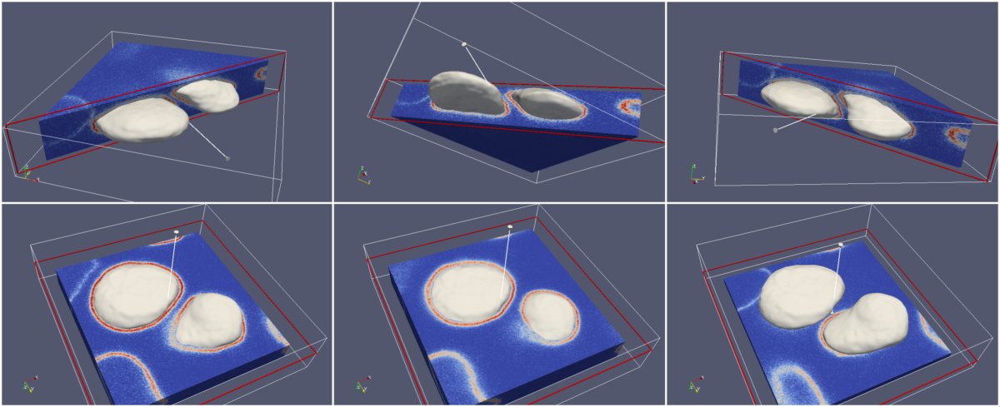

### Region Growing Segmentation

File xx.info contains information about the z-stack and a list of seeds coordinates. For each seed, we grow a blob shell-by-shell as we monitore the number of connected
components of the current shell. Only components larger than `Smin` pixels are allowed to grow. In addition, voxels of th current shell are allowed to recruit new voxels
for the next shell only if their intensity is lower than `threshold`.

#### Parameters

* `threshold`: maximum internsity allowed for a voxel to be incorporated in the growing blob.

* `Smin`: Minimum number of voxels that a component of a shell has to have in order to grow.

### Things to do and further improvements

>The algorithm prevents the growing region from leaking in many circustances, but this requires the leakage to occurs as a disconnected component. If this is not
the case, the algorithm will fail. Something else has to be done in those cases.

* Monitore the curvature of the growing region voxel-by-voxel and use it as another parameter to determine whether a given voxel can grow.

* Resample the resulting surface according to `SpacingXY` and `SpacingZ` specified info file.

* Implement a new method for generating seeds automatically.

### How to run

`./ShellExpansion -path PATH_TO_YOUR_INFO_FILE -smin 50 -threshold 15000`

*Matheus Palhares Viana 06.16.2016*

